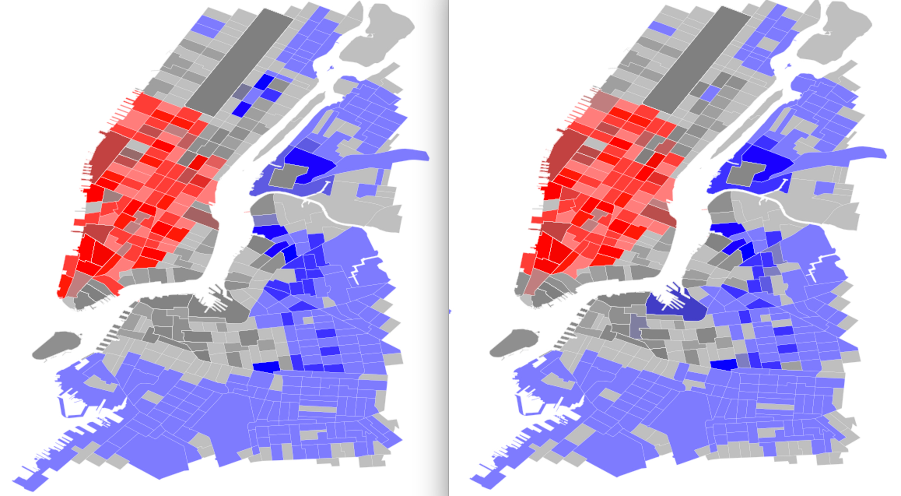

# HOMEWORK 10 ~ PUI2016
### Ian Wright
### iw453

## Assignment 1
In 'hw10_assign1' I simply include and re-run the notebook that we worked on in class for spatial analysis using geopandas and pysal. The technique uses spacial auto-correlation to detect spatial ridership patterns in citbike data. All credit to the guest lecturer Sina Kashuk for this work.

## Assignment 2
In 'hw10_assign2' I re-use the above analysis, but apply it to two distinct datasets: one for summer citibike rides and one for winter citibike rides.

The results for both seasons are EXTREMELY similar, with very few systemic differences to note. Slight variations in the degree of "hotness" or "coldness" can be found, but the unerlying pattern is almost identical. Perhaps of note is a stronger negative correlation in the upper east side during the summer time. This could be due to a huge range of effects - one example being a concentration of tourists in the UES that tend *not* to use Citibike.

**Fig 1:** Spacial autocorrelation shown with hotspots and coldspots; summer on left, winter on right

#### A note on group work:
None this time.
