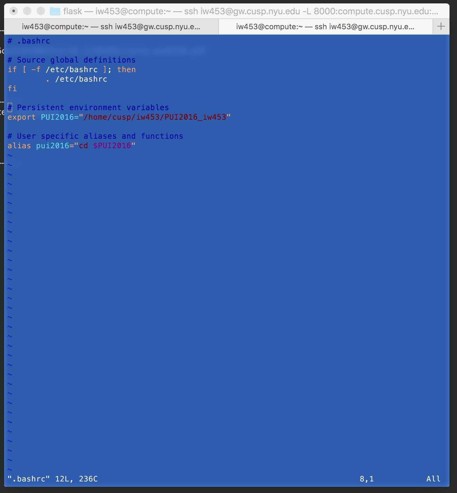
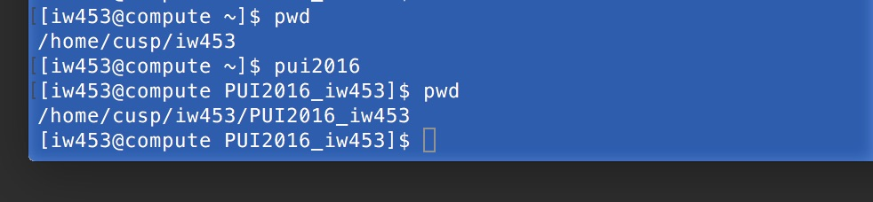

#HOMEWORK 1 ~ PUI2016
##Ian Wright
###iw453

I created an environment variable, PUI2016, to reference the path to my working directory for PUI2016 on compute. This is accessed by:
```
$PUI2016
```
This working directory is a clone of my github repo by the same name.

I also created an alias, pui2016, that will take me directly to that working directory, via a cd command. This is used as follows:
```
pui2016
```
Note that I've also set up a working directory for this class on my local machine, and it too clones the github repo. The $PUI2016 environment variable also exists on my local machine, with a unique reference to the working directory. This way, I should be able to work between 'compute' and locally seamlessly (hopefully).

My .bashrc file (editing in Vim) can be seen here:


A demonstration of the pui2016 alias on command line is seen here:

